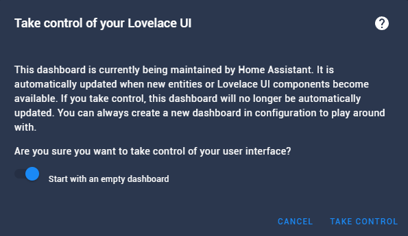
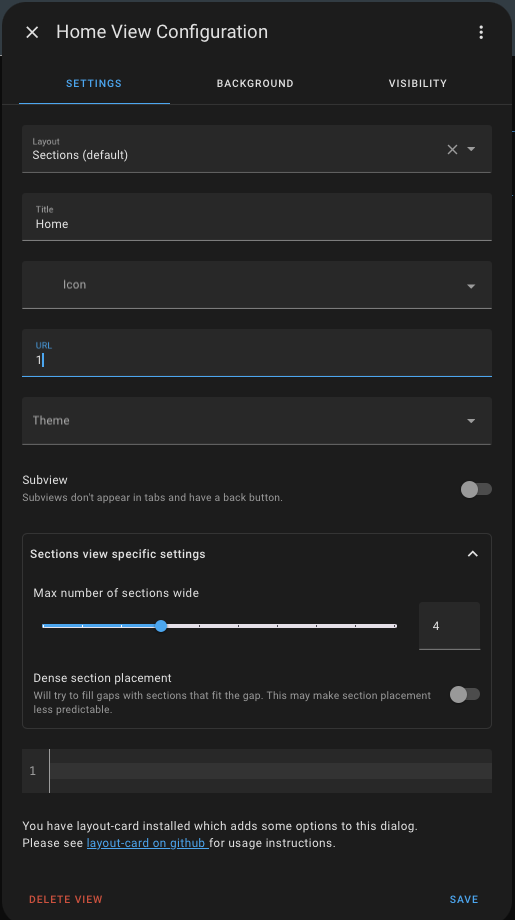

# Installation
### Step 1: Create New Dashboard
1. In Home Assistant, go to Settings > Dashboards and press the "Add Dashboard" button on the bottom right. Choose "New Dashboard from scratch" Choose a name and the URL for the dashboard. We will use ``echo-show`` as URL. 

2. Open the dashboard click on "Edit Dashboard" in the top right corner. Tick the "Start with an empty dashboard" option and press "Take Control"
   Note that this step might not appear depending on how you set-up new dashboards to appear".
 

3. Edit the view "Home".

 Rename it if you want, and choose "1" as the URL.

4. You can now create as many views as you like, the only important thing is that you give them unique numbers as URLs just like in the previous step. You can also do this later if you want.

5. Now we're finished in Home Assistant. Open the [Alexa Developer Console](https://developer.amazon.com/alexa/console/ask) and sign-in with the Amazon account that is linked to your Echo Show.
# Create an Alexa Smart Home Skill

### Step 6: Click on Create Skill
Navigate to [Alexa Developer Console](https://developer.amazon.com/alexa/console/ask) and click on **Create Skill**.

### Step 7: Configure Skill Basics
- **Name your skill** *(Only used in the console)*.
- Choose your **Primary Locale** (Country), if necessary.

### Step 8: Select Skill Type
- Choose the **Smart Home** radio button.
- Choose the **Custom** pane.
- Toggle **Sync Locales** to ON.

### Step 9: Hosting Options
- Choose **Alexa-hosted (Python)**.
- Select the hosted region closest to you.

Click **Next**.

### Step 10: Skill Template
- Choose **Start from scratch**.

### Step 11: Review and Create
- Review settings and click **Create**.
- Wait a few minutes for the skill to initialize.

### Step 12: Skill Dashboard
Once initialized, you'll see the skill dashboard.

### Step 13: Set Invocation Name
- Under "Building your skill" on the right, select **1. Invocation Name**.
- Enter a name for your skill. *(e.g., "dashboard viewer")*

Don’t forget to hit **Save**.

### Step 14: Menu Overview
Expand the menu on the left. It should look like this:

### Step 15: Delete Default Intent
- Delete the **Hello World** intent.
- Confirm deletion.

### Step 16: Create a Custom Intent
- Enter **OpenPageIntent**.
- Click on **Create custom intent**.

### Step 17: Add Intent Slots
- Under the intent, add a slot named **page**.
- Click the **+** under Intent Slots and select **Amazon Number**.

### Step 18: Add Sample Utterances
 - Enter the following under sample utterances:
