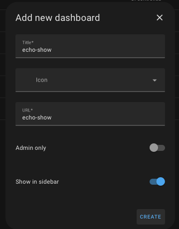
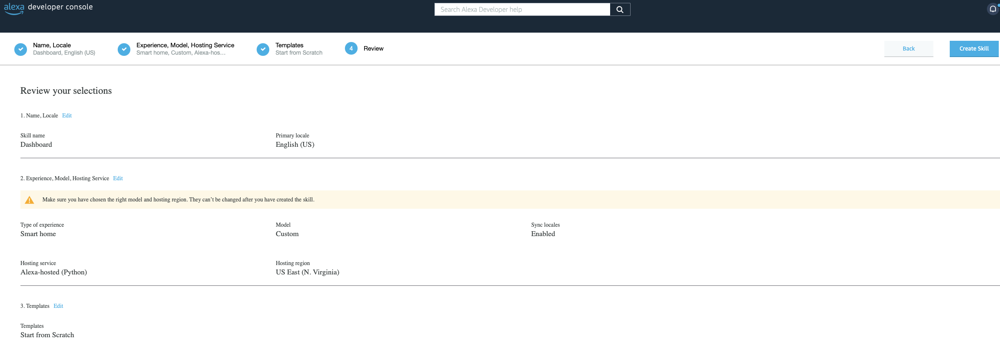
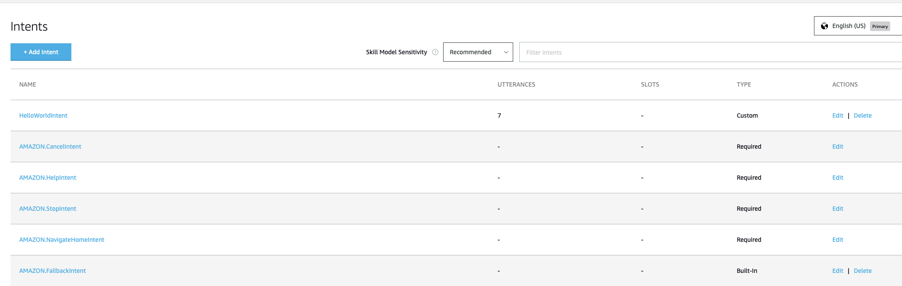

### I am in no way trying to take credit for this. I forked it because it was abandoned and needed an update for instructions

# Installation
### Step 1: Create New Dashboard
In Home Assistant, go to Settings > Dashboards and press the "Add Dashboard" button on the bottom right. 
Choose "New Dashboard from scratch" Choose a name and the URL for the dashboard. We will use ``echo-show`` as URL. 
<div align="center"></div>

### Step 2: Edit Dashboard
Open the dashboard click on "Edit Dashboard" in the top right corner. Tick the "Start with an empty dashboard" option and press "Take Control"
   Note that this step might not appear depending on how you set-up new dashboards to appear".
 <div align="center"></div>

### Step 3: Edit Dashboard View
Edit the view "Home".
<div align="center"></div> Rename it if you want, and choose "1" as the URL.<div align="center"></div>
<div></div>
You can now create as many views as you like, the only important thing is that you give them unique numbers as URLs just like in the previous step. You can also do this later if you want.

# Create an Alexa Smart Home Skill


### Step 4: Click on Create Skill
Navigate to [Alexa Developer Console](https://developer.amazon.com/alexa/console/ask) and click on **Create Skill**.

<div align="center"></div>

### Step 5: Configure Skill Basics
- **Name your skill** *(Only used in the console)*.
- Choose your **Primary Locale** (Country)
- 
  <div align="center"></div>


### Step 6: Select Skill Type
- Choose the **Smart Home** radio button.
- Choose the **Custom** pane.
- Toggle **Sync Locales** to ON.

<div align="center"></div>

### Step 7: Hosting Options
- Choose **Alexa-hosted (Python)**.
- Select the hosted region closest to you.

Click **Next**.

<div align="center"></div>

### Step 8: Skill Template
- Choose **Start from scratch**.

<div align="center"></div>

### Step 9: Review and Create
- Review settings and click **Create**.
- Wait a few minutes for the skill to initialize.

<div align="center"></div>
<div align="center"></div>


### Step 10: Skill Dashboard
Once initialized, you'll see the skill dashboard.

<div align="center"></div>

### Step 11: Set Invocation Name
- Under "Building your skill" on the right, select **1. Invocation Name**.
- Enter a name for your skill. *(e.g., "dashboard viewer")*

Don’t forget to hit **Save**.

<div align="center"></div>

### Step 12: Menu Overview
Expand the menu on the left. It should look like this:

<div align="center"></div>

### Step 13: Delete Default Intent
- Delete the **Hello World** intent.
- Confirm deletion.

<div align="center"></div>

### Step 14: Create a Custom Intent
- Enter **OpenPageIntent**.
- Click on **Create custom intent**.

<div align="center"></div>

### Step 15: Add Intent Slots
- Under the intent, add a slot named **page**.
- Click the **+** under Intent Slots and select **Amazon Number**.

<div align="center"></div>

<div align="center"></div>

### Step 16: Add Sample Utterances
 - Enter the following under sample utterances:

Confirm the slot auto-populates.

<div align="center"></div>

- Click on the slot **page** and ensure it looks correct.
- Add the utterance by clicking the **+** on the far right.
- Hit **Save** at the top.

<div align="center"></div>

### Step 19: Enable Interfaces
- Go to **Interfaces** on the left menu.
- Toggle **Alexa Presentation Layer** ON.
- Click **Save**.

<div align="center"></div>

### Step 20: Build the Skill
- Click on **Build** at the top bar.
- Select **Build Skill**.

<div align="center"></div>

- Wait for the build process to complete.

<div align="center"></div>

### Step 21: Code Editor
1. Navigate to the **Code** tab at the top.
2. Replace the content of the `lambda_function.py` file with the appropriate content from the repository.
3. Update the `DASHBOARD_URL` variable to match your Home Assistant URL. For example:
   DASHBOARD_URL = "https://homeassistant.local:8123/echo-show/"
- If you use Kiosk Mode, update the `KIOSK_MODE` variable accordingly.
4. Click **Save**.

<div align="center"></div>

### Step 22: Add Template File
1. Right-click on the **lambda** folder and select **Create File**.
2. Set the file path as `lambda/template.json`.
3. Paste the contents of the `template.json` from the repository.
4. Save and click **Deploy**.
5. Wait for the **Deployment Successful** notification.

<div align="center"></div>

### Step 23: Test the Skill
1. Go to the **Test** tab.
2. Enable skill testing in the **Development** environment.

<div align="center"></div>

### Step 24: Test on Your Alexa Device
- Use your Alexa device to test the skill:
- Say: "Alexa, open dashboard viewer."
- If prompted, sign in to your Home Assistant account. *(Enable "Keep me logged in.")*
- Test view selection by saying:
 ```
 Alexa, tell dashboard viewer open page <number>.
 ```
 Replace `<number>` with the desired view URL.

<div align="center"></div>
